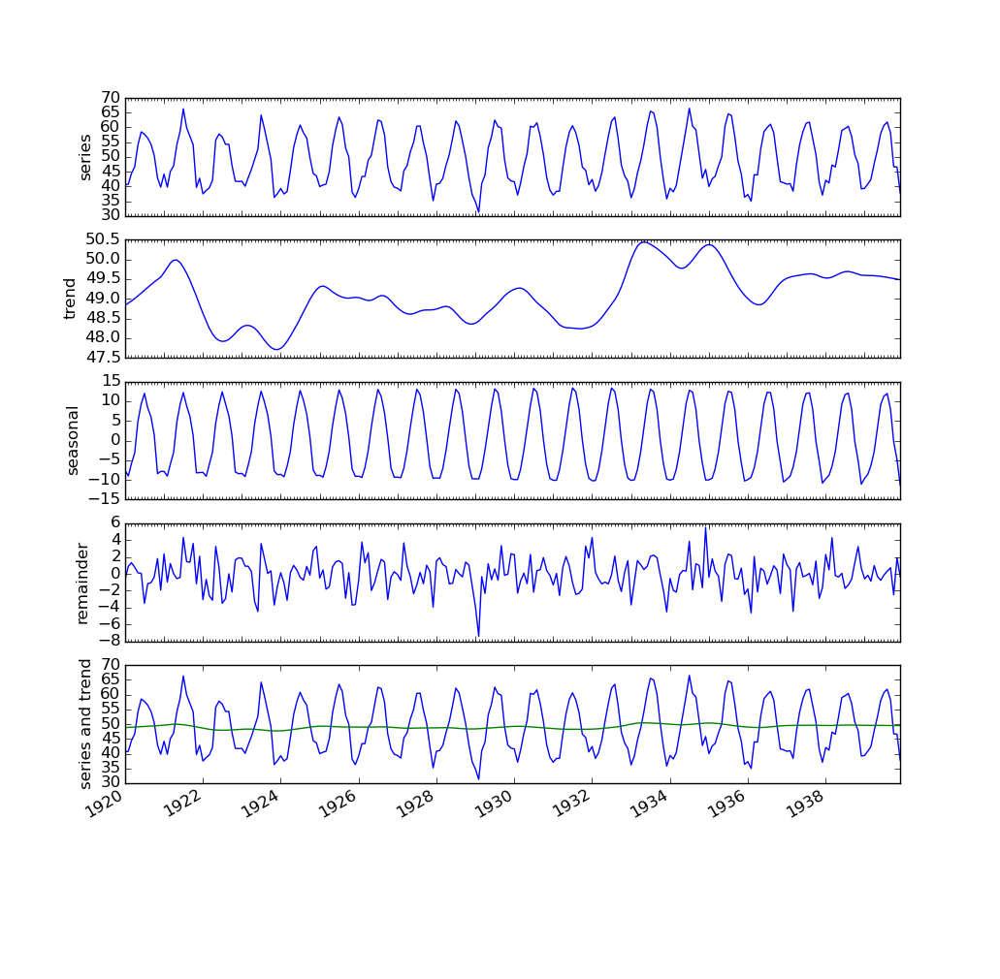

stl-java
========

A Java implementation of [STL: A Seasonal-Trend Decomposition Procedure Based on Loess](http://www.wessa.net/download/stl.pdf)

Example
-------

The following shows the result of running `STLDecomposition` on `src/test/resources/sample-timeseries.json`, plotted using `src/main/resources/plot-series.py`

