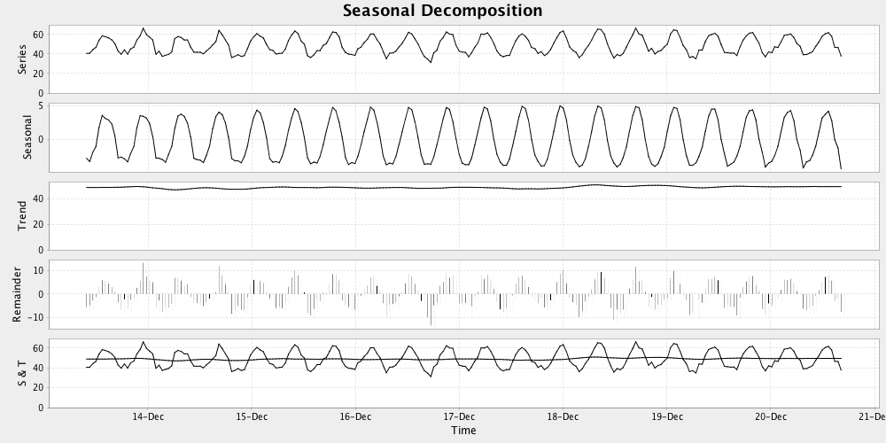

stl-java
========

A Java implementation of [STL: A Seasonal-Trend Decomposition Procedure Based on Loess](http://www.wessa.net/download/stl.pdf)

Example
-------

Assuming we have a time series of monthly data that is periodic with respect to years

```java
double[] ts;
double[] ys; // some dependent variable on ts
```

We can run STL as follows

```java
StlConfig config = new StlConfig();
config.setNumberOfObservations(12); // 12 months in a year
config.setNumberOfDataPoints(ts.length);

StlDecomposition stl = new StlDecomposition(config);
StlResult res = stl.decompose(ts, ys);
```

And optionally plot the results (n.b. `StlPlotter` is in test scope)

```java
StlPlotter.plot(res);
```


